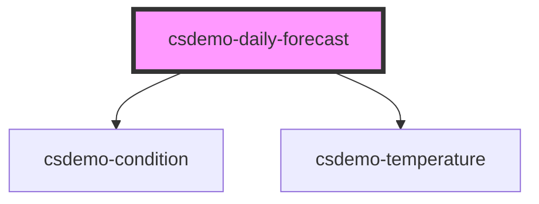

# csdemo-daily-forecast

<!-- Auto Generated Below -->

## Properties

| Property    | Attribute | Description                                                                                                                                                      | Type                 | Default     |
| ----------- | --------- | ---------------------------------------------------------------------------------------------------------------------------------------------------------------- | -------------------- | ----------- |
| `forecasts` | --        | An array of forecasts for the day. This allows the component to determine the overall condition to display for the day as well as the high and low temperatures. | `Forecast[]`         | `undefined` |
| `iconPaths` | --        | Override the default icon paths. If the default icon names that we have are used and put in `assets/images`.                                                     | `ConditionIconPaths` | `undefined` |
| `scale`     | `scale`   | The temperature is specified in Kelvin. The scale specifies the units to display the temperature in, 'C' for Celsius and 'F' for Fahrenheit.                     | `string`             | `undefined` |

## Dependencies

### Depends on

- [csdemo-condition](../csdemo-condition)
- [csdemo-temperature](../csdemo-temperature)

### Graph

----------------------------------------------

*Built with [StencilJS](https://stenciljs.com/)*
