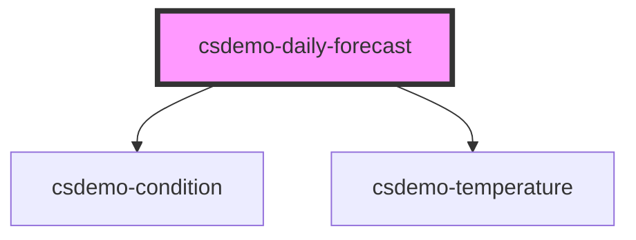

# csdemo-daily-forecast

<!-- Auto Generated Below -->

## Properties

| Property    | Attribute | Description | Type                 | Default     |
| ----------- | --------- | ----------- | -------------------- | ----------- |
| `forecasts` | --        |             | `Forecast[]`         | `undefined` |
| `iconPaths` | --        |             | `ConditionIconPaths` | `undefined` |
| `scale`     | `scale`   |             | `string`             | `undefined` |

## Dependencies

### Depends on

- [csdemo-condition](../csdemo-condition)
- [csdemo-temperature](../csdemo-temperature)

### Graph

----------------------------------------------

*Built with [StencilJS](https://stenciljs.com/)*
