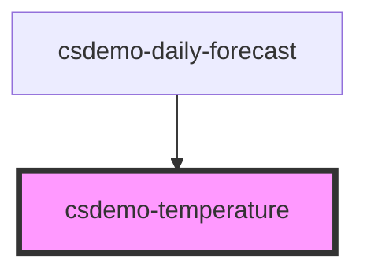

# csdemo-temperature

<!-- Auto Generated Below -->

## Properties

| Property      | Attribute     | Description | Type     | Default     |
| ------------- | ------------- | ----------- | -------- | ----------- |
| `scale`       | `scale`       |             | `string` | `undefined` |
| `temperature` | `temperature` |             | `number` | `undefined` |

## Dependencies

### Used by

 - [csdemo-daily-forecast](../csdemo-daily-forecast)

### Graph

----------------------------------------------

*Built with [StencilJS](https://stenciljs.com/)*
